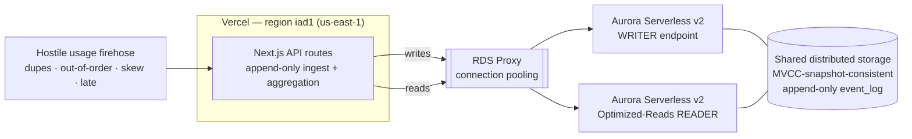

# Thabiti

**The metering engine that makes a usage invoice provably correct.**

> **Watermark-bounded temporal determinism** — the billed total for a window is
> **byte-identical across replays** despite late, out-of-order, and clock-skewed
> events, and once a window is **SEALED**, no later event can ever mutate it.

Usage-based billing competes on exactly one thing: **trust in the number.**
Customers are charged real money off an aggregate computed over a messy event
stream. Thabiti turns a hostile, real-world usage-event firehose — duplicates,
out-of-order delivery, clock skew, late stragglers — into **one provably correct
invoice, the same invoice every single time.**

The billed total is a **SQL fact, not a JavaScript reduce**: a single
deterministic window-function aggregation over an append-only log, under a
**total order** that makes the result replay-invariant *by construction*.

*(Thabiti is Swahili for steadfast / constant / unchanging — the product's only
promise is that the billed number does not move.)*

---

## The guarantee

Three properties, each proven by a property test that runs against **both**
backends (in-memory and Aurora) for any seed:

1. **Replay-order invariance** — ingest the same event set in any number of
   arrival orders (shuffled, duplicated, skewed) → the billed total is identical
   to the byte.
2. **Sealed-window immutability** — once the watermark passes a window's close,
   the window seals. A later event whose event-time falls inside it is **not
   merged** — it is quarantined into an audited *correction epoch*. The sealed
   number does not move.
3. **Crash-replay equivalence** — hard-kill the ingester mid-flood (`kill -9`),
   restart, re-ingest from the durable append-only log → the recovered total is
   bit-identical to the deterministic projection.

**What the guarantee precisely says.** Determinism is *watermark-bounded*: the
billed total is a pure function of the **admitted event set**, evaluated under
the canonical total order. The determinism-critical paths therefore seal at the
end of the admitted set — the watermark's allowed-lateness bound defines what is
admitted vs. quarantined. (Sealing a window mid-flood and *then* delivering a
genuinely in-window event beyond the lateness bound correctly quarantines it;
that is the immutability guarantee at work, not a contradiction of it. See
[docs/ARCHITECTURE.md](docs/ARCHITECTURE.md#why-seal-at-end-on-the-determinism-paths).)

Deduplication and idempotency exist here as **plumbing** — necessary, never the
headline. The headline is temporal determinism and window sealing.

## The < 3-minute demo

One seeded, scripted run drives four beats (`npm run harness`):

1. **The flood** — a hostile firehose hits the writer; writer ACU spikes, reader
   ACU rises as the deterministic aggregation folds the log.
2. **The seal** — a window seals on screen as the watermark advances; a late
   event lands inside it and is **quarantined**, not merged. The sealed total is
   unchanged.
3. **The crash** — the ingester is hard-killed mid-flood; on restart the invoice
   recovers **bit-identical**, and the same set replayed in three arrival orders
   yields the same total, side by side.
4. **The collapse** — the flood ends; writer and reader ACU collapse to ~0 and
   the run's **cost** is shown, computed from measured ACU-seconds × the
   published Aurora ACU-hour price. Zero idle spend.

## Quickstart (zero cloud dependencies)

The entire app, test suite, and chaos harness run locally with **no AWS account**
on the in-memory backend, which faithfully reproduces the exact same invariant.

```bash
npm install
npm test            # property tests: replay invariance, sealed rejection, crash-replay
npm run dev         # http://localhost:3000  (THABITI_BACKEND defaults to memory)
```

In a second terminal, with the dev server running:

```bash
npm run harness        # the narrated four-beat hostile run (incl. real kill -9)
npm run harness:crash  # the crash-replay equivalence proof on its own
npm run db:check       # replay one seed in 3 arrival orders → byte-identical total
```

Open `http://localhost:3000` and click **Run hostile demo** to watch the
watermark advance, windows seal, a straggler get quarantined, three replays land
equal, and the ACU graphs spike then collapse.

## Architecture



Why Aurora is the protagonist, not a store:

- **Writer / reader split.** The firehose hammers the **writer** with append-only
  inserts; the heavy window-function aggregation runs on the **Optimized-Reads
  reader**, isolated from ingest pressure — the two scale independently.
- **Serverless v2 autoscaling (min ≈ 0).** Compute appears to meet a hostile
  burst and disappears between runs. The scale-up-then-collapse and proportional
  cost are the story — a fixed-size instance cannot show it.
- **One MVCC-snapshot-consistent log.** The aggregation reads a single consistent
  snapshot of the append-only log; combined with the total order, the result is
  stable and reproducible *at scale and under concurrent ingest*. (The
  determinism itself rests on the total order + exact integer arithmetic — which
  is exactly why the in-memory engine reproduces the same bytes; Aurora is what
  makes that hold for a real firehose against a live writer while the reader
  folds the log on an isolated snapshot.)
- **RDS Proxy** pools connections so serverless functions never storm Postgres.
- **Region pinning.** `vercel.json` pins functions to `iad1`, adjacent to the
  cluster, killing cross-region latency to the writer/reader.

See [docs/ARCHITECTURE.md](docs/ARCHITECTURE.md) for the full data flow and
[docs/AURORA_SETUP.md](docs/AURORA_SETUP.md) to provision it.

## The deterministic SQL

The billed total is produced by one window-function aggregation over the
append-only log, on the reader endpoint. The load-bearing line is the **total
order** ([src/lib/sql/aggregate.sql](src/lib/sql/aggregate.sql)):

```sql
SUM(quantity_micros) OVER (
  ORDER BY event_time_ms, event_id          -- TOTAL order: event_id is unique
  ROWS BETWEEN UNBOUNDED PRECEDING AND CURRENT ROW
)
```

`(event_time, event_id)` is a *total* order, so the running aggregate is
identical regardless of physical row order — that is why "identical across three
replays" is true because the database computes it deterministically, not because
application code added the same numbers in the same order. Money is summed as
exact `bigint` micro-units, so totals are associative and match
[the in-memory engine](src/lib/engine/determinism.ts) byte-for-byte. This parity
is guarded two ways: `tests/sql-drift.test.ts` pins the SQL text byte-for-byte to
the canonical strings the engine executes, and the memory↔aurora parity test
asserts identical totals for the same seed **when `AURORA_WRITER_URL` is set**
(it skips otherwise, so run it against a cluster to see it green).

## Backends

A single `MeteringEngine` interface, two implementations selected by one env var:

| `THABITI_BACKEND` | Engine | Notes |
|---|---|---|
| `memory` (default) | in-process | Zero cloud deps. Reproduces watermarks, sealing, quarantine, and the same total-order aggregation. Optional durable WAL. Powers local dev, CI, and the harness. |
| `aurora` | Aurora PostgreSQL Serverless v2 | The deterministic SQL is the source of truth. Writer/reader pools via RDS Proxy. |

**Same application code, same property tests, same chaos harness on both.** For
any seed, both backends produce the identical billed total.

## Tests

```bash
npm test          # vitest: property + integration + SQL drift guard
npm run typecheck # tsc --noEmit (strict)
```

The property tests in [`tests/`](tests) are the spec — they were written before
the cloud engine existed. Set `AURORA_WRITER_URL` to run the identical suite and
the memory↔aurora parity test against a real cluster.

## Project layout

```
src/
  lib/
    engine/        MeteringEngine interface, memory + aurora engines, total-order rule
    sql/           schema.sql, aggregate.sql, embedded canonical strings
    decimal.ts     exact bigint micro-unit arithmetic
    uuidv7.ts      client-generated time-ordered ids
    acu.ts         ACU telemetry (simulated for memory, CloudWatch for aurora)
  app/             Next.js App Router — API routes + the live dashboard
  components/      dashboard panels (timeline, ACU, replay, quarantine, SQL)
  harness/         seeded hostile generator, four-beat run, kill -9 crash proof
tests/             invariant property tests (the spec)
```

## License

MIT — see [LICENSE](LICENSE).
